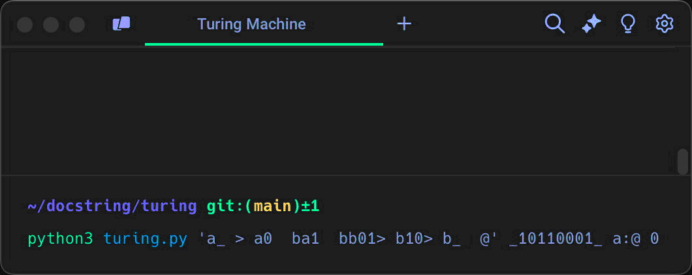

# Machine de Turing

Implémentation d'une [machine de Turing][wikipedia].  
Défi proposé sur le Discord de [Docstring][docstring].

### Exécution du script

```sh
python3 turing.py <program> <tape> <i>:<t1[, t2, ..., tn]> <head>
```

- `program` : programme exécutable par la machine
- `tape` : état initial du ruban
- `i` : état initial de la machine
- `tj` : liste des états terminaux de la machine
- `head` : position initiale de la tête de lecture / écriture sur le ruban

### Anatomie d'un programme en langage machine

Le programme est exprimé par un ensemble d'instructions interprétables par la machine de Turing. Chaque instruction est elle-même constituée d'un quintuplet `<s,r,w,m,n>`, comme nous allons le détailler ci-dessous. Prenons, par exemple, le cas d'un programme qui effectue une simple négation bit à bit d'un nombre binaire :

```
Inscrivons le nombre binaire 10110001 sur le ruban de la machine :


                             numérotation des cases du ruban

                          0   1   2   3   4   5   6   7   8   9
                        ┌───┬───┬───┬───┬───┬───┬───┬───┬───┬───┐
État initial du ruban : │   │ 1 │ 0 │ 1 │ 1 │ 0 │ 0 │ 0 │ 1 │   │
                        └───┴───┴───┴───┴───┴───┴───┴───┴───┴───┘
                          ▲
            position initiale de la tête
                de lecture / écriture


Voici les instructions du programme qui effectue la négation bit à bit :

  ┌────────────────── s [state]      état courant de la machine
  │   ┌────────────── r [read]       lecture du ruban
  │   │   ┌────────── w [write]      écriture sur le ruban
  │   │   │   ┌────── m [move]       déplacement de la tête sur le ruban
  │   │   │   │   ┌── n [new state]  nouvel état de la machine
  ▼   ▼   ▼   ▼   ▼
┌───┬───┬───┬───┬───┐
│ a │ _ │   │ > │   │ [a] est l'état initial de la machine
│ a │ 0 │   │   │ b │
│ a │ 1 │   │   │ b │
│ b │ _ │   │   │ @ │ [@] => terminaison du programme
│ b │ 0 │ 1 │ > │   │
│ b │ 1 │   │ > │   │
└───┴───┴───┴───┴───┘
└───┬───┘└────┬─────┘
    ▲         ▼
 entrées   sorties
```

- `{ a, b, @ }` constitue l'ensemble des états que peut prendre la machine.
- `a` est l'état initial de la machine.
- `@` est l'état qui marque la terminaison du programme et l'arrêt de la machine.
- `_` indique la lecture d'une case vide (symbole "blanc") sur le ruban.
- `<` est la commande de déplacement de la tête d'une case vers la gauche.
- `>` est la commande de déplacement de la tête d'une case vers la droite.

### Exemples d'utilisation du script

**Négation d'un nombre binaire**

```sh
python3 turing.py 'a_ > a0  ba1  bb01> b10> b_  @' _10110001_ a:@ 0
```



**Addition de deux nombres binaires**

```sh
python3 turing.py 'a0 > a1 > a_ >bb0 > b1 > b_ <cc01< c10<dc_ >fd0 < d1 < d_ <ee01>ae10< e_1>af1_> f_  @' _11011_1001_ a:@ 1
```


_N.B. : en fonction des données à traiter, veillez à prévoir un ruban suffisamment large pour qu'il n'y ait pas de débordement lors du déplacement de la tête de lecture / écriture._

[wikipedia]: https://fr.wikipedia.org/wiki/Machine_de_Turing
[docstring]: https://www.docstring.fr